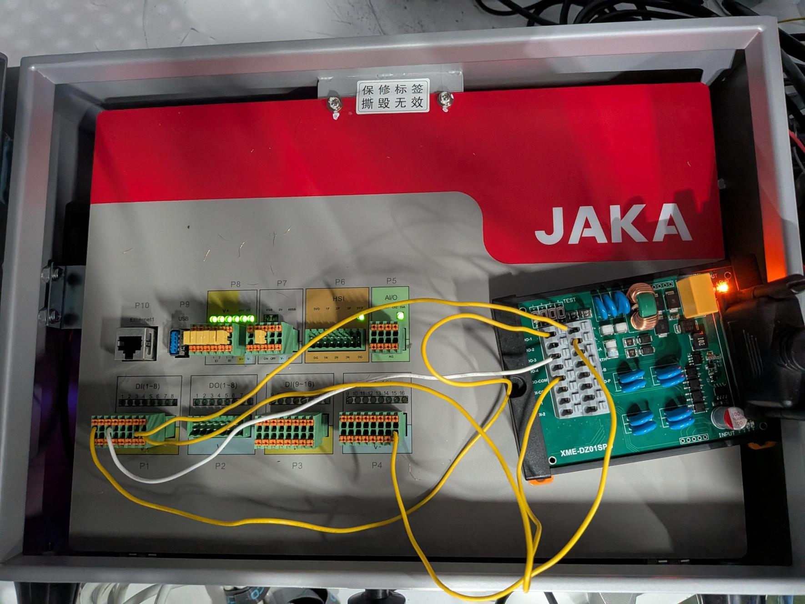

# Multimodal Cobot Control System

A computer vision– and machine learning–guided control system for a JAKA collaborative robot arm, combining **real-time object detection**, **closed-loop visual servoing**, a **from-scratch camera calibration pipeline**, and a **large language model (LLM)** command interpreter with **local speech recognition** — letting an operator perform precision assembly tasks hands-free, in natural language, without manually teach-pending every motion.

### 🎥 Demo Video

[](https://youtu.be/-4sJVdZdFJw)

*Click the thumbnail above to watch the full system in action — vision-guided alignment, automated fastening, voice commands, and live safety-rejection of an unsafe command.*

---

## Overview

This system uses a custom-trained computer vision model and a closed-loop PID controller to visually guide a JAKA Zu5 collaborative robot arm into sub-millimeter alignment with a target, then executes automated fastening/unfastening — all triggerable by voice. Anything outside the pre-defined vocabulary (draw shapes, perform gestures, freeform motion requests) is handled by an LLM that generates robot code on the fly. Every command, whether from a deterministic parser or an LLM, passes through a single hardware-enforced safety chokepoint before it's allowed to move real hardware.

It was built as a from-scratch exploration of **multimodal human-robot interaction**: fusing machine learning, real-time computer vision, classical control theory (PID), and natural language understanding into one coherent system running across three cooperating processes.

**Core capabilities:**
- 👁️ **Vision-guided alignment** — a custom-trained machine learning object detection model and a closed-loop PID controller visually servo the robot's tool onto a target with sub-millimeter precision
- 📐 **From-scratch camera calibration** — a full ChArUco calibration pipeline (marker-dictionary identification, intrinsic solving, sub-pixel corner refinement) achieving 0.24px reprojection error and ~1% real-world measurement accuracy
- 🔩 **Automated assembly** — taught fastening/unfastening routines execute screw-driving operations, including an "unfasten/fasten the currently-aligned target" mode chained directly off the vision system
- 🤖 **LLM-driven freeform motion** — natural language requests ("do a dance," "draw a circle") are translated into robot motion by GPT-4o, with every generated command safety-checked before execution
- 🎙️ **Voice control** — hold-to-talk speech input, transcribed locally, routed through a two-tier command interpreter
- 🛡️ **Safety-critical command verification** — joint-angle envelopes, per-move distance caps, and command-count limits are enforced in code, not just prompted for

---

## Engineering Highlights

| | |
|---|---|
| **~30fps** | Real-time machine learning object detection against the live camera feed |
| **0.24px** | Camera calibration reprojection error (from-scratch ChArUco pipeline) |
| **~1%** | Real-world measurement accuracy, validated against known ground truth |
| **~6–13 iterations** | Typical convergence to final alignment (closed-loop PID, sub-mm final error) |
| **3** | Independent Python runtimes coordinated in one system (SDK compatibility constraints) |
| **0** | Unvetted LLM-generated commands that have ever reached the robot (proxy + whitelist verification) |

A live self-collision incident during a stakeholder demo was root-caused the same day (missing joint-limit enforcement on LLM-issued motion) and closed with a hardware-enforced fix — see [Safety Systems](#safety-systems).

---

## System Architecture

The JAKA robot SDK, the RealSense camera SDK, and the speech/LLM stack each require **mutually incompatible Python runtimes** — so this is architected as three cooperating processes communicating over a custom TCP protocol, not a single monolithic script.

```
                    ┌──────────────────────────┐
                    │   robot_client.py         │   Python 3.7
                    │   (sole owner of the      │◄──────────────────┐
                    │   robot connection)        │                   │
                    │                            │                   │
                    │  • JAKA SDK (jkrc)         │                   │
                    │  • Safety envelope check   │                   │
                    │  • threading.Lock-serial-  │                   │
                    │    ized command execution  │                   │
                    └────────────▲───────────────┘                   │
                                 │ TCP (localhost:9100)               │
                     length-prefixed JSON frames                     │
                                 │                                    │
              ┌──────────────────┴───────────────┐    ┌───────────────┴────────────────┐
              │  vision_alignment.py              │    │  voice_control.py                │
              │  (Python 3.12)                     │    │  (Python 3.14)                    │
              │                                     │    │                                    │
              │  • RealSense depth camera           │    │  • Whisper (local speech-to-text) │
              │  • YOLOv8 screw detection            │    │  • Keyword command parser          │
              │  • ChArUco camera calibration        │    │  • llm_command_generator.py       │
              │  • PID closed-loop alignment          │    │    (GPT-4o freeform fallback)     │
              │  • WASD teleop + click-to-measure     │    │                                    │
              └──────────────────┬─────────────────┘    └───────────────┬──────────────────┘
                                 │                                       │
                                 │        vision_command.json            │
                                 └────────── (file-based trigger) ◄──────┘
                    voice-issued "calibrate"/"align" become a synthetic
                    keypress inside the vision loop — same tested code
                    path as the keyboard controls
```

**Why three processes, not one:** the JAKA vendor SDK only loads on Python 3.7; `pyrealsense2` targets 3.12; the Whisper/LLM stack runs on 3.14. Rather than fight binary compatibility, the system embraces it — one process per runtime, coordinated over sockets.

**Why a single "gatekeeper" process:** an earlier design had voice and vision *each* independently connect to the robot — a real hazard, since two uncoordinated processes could issue conflicting motion simultaneously. The current design routes every command through one process (`robot_client.py`), serialized by a `threading.Lock`, so concurrent motion is structurally impossible rather than merely unlikely.

---

## Machine Learning & Computer Vision

### Object Detection
A **machine learning** object detection model (**YOLOv8**, via Ultralytics) detects screw heads in the live camera feed for vision-guided alignment, trained on a custom dataset of mounted screw images — bounding-box annotation was done using Roboflow (annotation/export only; training and inference are both custom-built, see below). Detection runs at ~30fps against the RealSense color stream.

### Camera Calibration
Full **ChArUco (ArUco + chessboard) camera calibration** pipeline built from scratch — board detection, marker-dictionary identification, and intrinsic calibration (`cv2.aruco.CharucoBoard` / `CharucoDetector`) — producing a camera matrix and distortion coefficients used for real-world pixel-to-millimeter measurement. Achieved **0.24px reprojection error** and validated to **~1% real-world measurement accuracy** against the board's own known dimensions.

Need a board to calibrate your own camera? [Generate a printable ChArUco pattern at calib.io](https://calib.io/pages/camera-calibration-pattern-generator) — this project's board uses a 4×5 grid, 50mm squares, 37mm markers, and the `DICT_4X4_50` ArUco dictionary.

### Closed-Loop Visual Servoing (PID Control)
XY alignment uses a tuned **PID controller** (proportional-integral, derivative available) closing the loop on live detection error every iteration — not a one-shot open-loop move. Gains were tuned empirically using custom-built CSV telemetry logging of every control-loop iteration, which also diagnosed a false "instability" as a target-selection bug in the detector rather than a controller problem. Z-axis correction uses the robot's own encoder position relative to a calibrated reference pose (more reliable than the depth sensor at close range), while XY correction remains fully vision-driven.

### LLM-Based Command Generation
Freeform voice commands are sent to **GPT-4o** via the OpenAI Chat Completions API with a system prompt documenting the robot's full motion API. The model's generated code is never executed directly against hardware — it's run against a proxy object that *records* intended SDK calls (via Python's `__getattr__` hook) instead of executing them, producing an inspectable list of intended actions that passes through a function whitelist before any real motion occurs.

---

## Command Routing: Deterministic Parsing vs. LLM Fallback

Voice input doesn't go straight to the LLM — it passes through a **two-tier interpreter** designed so the common, safety-relevant commands never depend on a network call:

1. **Keyword tier (checked first):** simple, high-frequency commands — directional jogs, screw fasten/unfasten, calibrate, align, quit — are matched with regular expressions and executed immediately. No API call, no latency, no internet dependency, and no possibility of an LLM misinterpreting a routine instruction.
2. **LLM tier (fallback only):** if any part of what was said doesn't match a known pattern, the **entire phrase** is sent to GPT-4o, which generates the appropriate robot code. This is deliberately all-or-nothing per phrase — a command isn't half-parsed by keywords and half-guessed by the LLM.

This means the system's core functionality (movement, alignment, fastening) works even if the LLM API is unreachable — the network dependency is quarantined to the "creative" tier of commands.

---

## Safety Systems

Safety is enforced in code at the one architectural chokepoint every command passes through — never left to trusting an LLM's compliance with prompt instructions alone.

| Layer | What it does |
|---|---|
| **Joint-angle envelope** | Empirically measured safe range per joint; any generated motion outside it is rejected before execution |
| **Per-move linear distance cap** | Caps any single linear move to a safe maximum, preventing large erroneous jogs |
| **LLM command-count cap** | Rejects abnormally large command sequences (guards against runaway/looping LLM generations) |
| **Proxy-verified LLM execution** | GPT-generated code is recorded and whitelist-filtered before touching the robot; unknown/hallucinated function calls are dropped |
| **Concurrency lock** | A single `threading.Lock` in the robot process serializes all commands from all clients |
| **Lens VPS** (Visual Protection System) — external human-detection safety system *(separate hardware, not included in this repository)* | A dedicated external device using machine learning to detect people near the workspace, drawing bounding boxes and applying two-zone deceleration — full stop within close range, automatic slow-down at a further range — reducing reaction time compared to a manual e-stop. Integrates with the JAKA controller as a standalone add-on. |

<p align="center">
  
  <br>
  <em>Electrical/I-O connection for the optional Lens VPS (Visual Protection System) external human-detection safety system, wired into the JAKA controller's digital I/O terminals.</em>
</p>

---

## Hardware Requirements

| Component | Used for |
|---|---|
| **JAKA Zu5** collaborative robot arm | The controlled robot; requires the vendor Python SDK (`jkrc`, vendored in `out/`) |
| **Intel RealSense D435if** depth camera | Screw detection, ChArUco calibration, depth-based measurement — requires a **USB 3.0 (USB-C)** port; USB 2.0 silently limits resolution/framerate instead of failing clearly |
| Microphone | Voice command input |
| **Atlas Copco** fastening/unfastening tool | Digital I/O–controlled end-effector for screw-driving. The control architecture is tool-agnostic — any compatible fastening tool or end-effector can be substituted with only IO pin configuration changes |
| *(Optional, external)* ML-based human-detection safety device | Separate hardware unit; see Safety Systems above |

---

## Technical Stack

**Machine Learning / Computer Vision:**
- Ultralytics YOLOv8 — custom-trained machine learning model for object detection
- OpenCV (`cv2.aruco`) — ChArUco camera calibration & marker detection
- Intel RealSense SDK (`pyrealsense2`) — depth sensing
- NumPy — geometric/control-loop computation

**Natural Language / LLM:**
- OpenAI Whisper — local speech-to-text inference
- OpenAI GPT-4o (Chat Completions API) — natural-language-to-robot-code generation

**Robotics & Control:**
- JAKA Zu5 vendor SDK (`jkrc`)
- Custom PID closed-loop controller

**Systems / Infrastructure:**
- Python (three interpreter versions — 3.7 / 3.12 / 3.14 — run concurrently to satisfy incompatible native dependencies)
- Custom TCP socket protocol (length-prefixed JSON framing) for inter-process communication
- `threading` — concurrency-safe command serialization
- `sounddevice`, `keyboard` — audio I/O and push-to-talk input
- Windows batch orchestration for multi-interpreter process startup
- Git/GitHub version control

---

## Installation & Setup

This project requires **three separate Python installations** (3.7, 3.12, 3.14) due to native-dependency constraints described above — install each via the Windows Python launcher (`py -3.7`, `py -3.12`, `py -3.14`).

```bash
# Python 3.7 — robot control (no pip packages needed beyond the vendored JAKA SDK)
py -3.7 -m pip install -r requirements-robot.txt

# Python 3.12 — vision / camera / detection
py -3.12 -m pip install -r requirements-vision.txt

# Python 3.14 — voice / LLM
py -3.14 -m pip install -r requirements-voice.txt

# Python 3.12 — Optional UI
py -3.12 -m pip install -r requirements-panel-optional.txt
```

**Environment variables:** create a `.env` file in the repo root:
```
OPENAI_API_KEY=your-key-here
```

**Camera calibration:** run the ChArUco calibration pipeline in `camera_calibration/` once with your own camera before first use — `identify_charuco.py` to confirm your board's marker dictionary, then `charuco_capture.py` + `charuco_calibrate.py` to produce `camera_calibration.json`. Need a physical board? [Generate one at calib.io](https://calib.io/pages/camera-calibration-pattern-generator).

**Trained model:** the production screw-detection weights are included directly in this repo (`runs/detect/head_detect/weights/best.pt`, ~6MB) — no separate download needed to run the system as-is.

**Hardware sanity checks:** before running the full system, verify each hardware component independently with the scripts in `hardware_tests/`:
```bash
py -3.7  hardware_tests/test_robot_movement.py   # robot connects + makes one small move
py -3.12 hardware_tests/test_camera_feed.py      # RealSense RGB + depth stream
py -3.14 hardware_tests/test_microphone.py       # records 5s, reports peak volume
```

---

## Usage

Launch the full system with one command:
```bash
./start_system.bat
```
This starts all three processes in dependency order (robot client → vision → voice), each under its required Python interpreter.

---

## Optional: GUI Control Panel

For anyone who'd rather not memorize voice phrases or keyboard shortcuts, `control_panel.py` is an optional single-window control panel that launches the same three processes and gives button-based control instead.

**This is entirely optional** — `start_system.bat` and the voice/keyboard workflow above work exactly as documented, unchanged. The panel is an additional way to run the system, not a replacement.

**What it does:**
- One-click **Start System** / **Stop System** — launches `robot_client.py`, `vision_alignment.py`, and `voice_control.py` under their required Python interpreters, with a combined log instead of three terminal windows.
- On-screen buttons for jog movement, Calibrate, Align, Fasten/Unfasten per screw, Go Home, and a push-to-talk button (equivalent to holding spacebar).
- The live camera feed is embedded directly in the panel window, and clicks/keypresses (WASD, C, T, Escape, click-to-measure) are forwarded to the real vision window, so those controls keep working from inside the panel.

**Known limitation — read before relying on it:** the panel's "Cancel Next Move" button does **not** stop a move that's already in progress — it only prevents the *next* queued command from executing. This is a limitation in how commands are serialized in `robot_client.py`, not something the panel works around. **If the robot needs to be stopped mid-motion, use the physical emergency stop — this button is not a substitute for it.**

**Setup:**
```bash
py -3.12 -m pip install -r requirements-panel-optional.txt


### Voice Command Reference

**Keyword tier (instant, no network required):**
| Say | Action |
|---|---|
| "move right 20" / "move up 30" | Directional jog (default 10mm) |
| "left 10 and forward 20" | Chained commands, executed in order |
| "go near screw one" | Move to a taught approach pose |
| "calibrate" | Save current screw position as the alignment target |
| "align" | Run closed-loop PID alignment to the calibrated target |
| "fasten screw two" / "unfasten screw three" | Run the taught fastening/unfastening routine |
| "unfasten the screw" | Unfasten at the current (aligned) position — no number needed |
| "loosen" / "tighten" | Synonyms for unfasten/fasten |
| "quit" | Exit the voice process cleanly |

**LLM tier — examples (interpreted by GPT-4o, safety-checked before execution):**
| Say | What happens |
|---|---|
| "draw a square" | Traces a 4-sided closed path (defaults to 50mm per side if unspecified) |
| "draw a triangle" | Equilateral triangle via computed vertex offsets |
| "draw a circle" / "draw a circle with radius 60" | Circular path — arc geometry computed by tested code, not LLM-generated math |
| "do a dance" / "wave hello" / "take a bow" | Small expressive joint sequences, bounded to a safe angular range and a maximum command count per request |
| "spin the screwdriver" / "stop spinning" | Direct digital I/O control of the fastening tool motor |
| "go home" | Returns to a predefined safe joint configuration |
| "stop" / "abort" | Immediate motion abort |
| "move right 500" | **Rejected** — exceeds the per-move safety cap, zero motion |
| "make me a sandwich" | **Rejected** — not a parseable robot instruction, zero motion |

**Keyboard controls (vision window):** `W`/`A`/`S`/`D`/`Q`/`E` jog the robot; `C` calibrates; `T` runs alignment; click two points to measure real-world distance between them; `ESC` quits.

---

## Project Structure

```
├── robot_client.py           # Python 3.7 — sole robot connection, command dispatch, safety enforcement
├── vision_alignment.py       # Python 3.12 — camera, YOLO detection, PID alignment, teleop
├── voice_control.py          # Python 3.14 — speech capture, command routing
├── llm_command_generator.py  # GPT-4o integration, proxy-verified code generation
├── screw_operations.py       # Taught fasten/unfasten motion routines
├── start_system.bat          # Launches all three processes in order
├── __common.py                # JAKA SDK environment bootstrap
├── requirements-robot.txt
├── requirements-vision.txt
├── requirements-voice.txt
├── images/                    # README documentation images
├── camera_calibration/        # ChArUco calibration capture/solve scripts + calibration data
├── training/                  # YOLO training & detection-experiment scripts
├── hardware_tests/            # Standalone connectivity checks (robot / camera / mic)
├── out/                       # Vendored JAKA SDK binaries
└── mounted_screw_dataset/,    # Training datasets (gitignored — see Datasets below)
    screw_dataset/, runs/
```

---

## Datasets & Training

The machine learning model was trained on a custom bounding-box-annotated dataset exported in YOLOv8 format (see Object Detection above for the annotation workflow). The **trained model weights are included directly** in this repo (see Installation above), so no dataset download is required to *run* the system — but if you want to extend or retrain the detector on your own screws, here's the dataset:

- **[Download: Screw head detection dataset](https://github.com/gcharlson25/Jaka-Voice-Controlled-Cobot/raw/main/training/mounted_screw_dataset.zip)** (224 images, YOLOv8 format)
- **[Download: Screw detection dataset — early iteration](https://github.com/gcharlson25/Jaka-Voice-Controlled-Cobot/raw/main/training/screw_dataset.zip)** (199 images, YOLOv8 format)

Unzip into `mounted_screw_dataset/` at the repo root, then retrain with `training/train_head.py`.

---

## Known Limitations

- The machine learning object detection model is trained on a limited set of screw types/viewpoints; detection can be less stable on unfamiliar screws or extreme viewing angles.
- Depth-sensor accuracy degrades on reflective/specular surfaces (a known limitation of stereo depth cameras) — Z-axis alignment mitigates this by using the robot's own encoder position instead of depth for the final correction.
- Per-move safety caps bound individual commands but not yet cumulative drift across a long sequence of small legal moves (a full Cartesian workspace-boundary check is a planned improvement).
- Chaining vision-guided alignment directly into the fastening motion is supported, but its reliability is currently bounded by an empirically-derived (rather than fully hand-eye calibrated) camera-to-tool offset.
